# Voice translation pipeline (English → Hindi)

Speak English into your mic, hear Hindi out of your speaker a few seconds
later. Under the hood: mic → VAD segmentation → Groq Whisper ASR → LLM
translation → Hindi TTS → playback.

## How it works

The trick to keeping this fast isn't the models — it's deciding where to cut
the audio. Translating word-by-word doesn't work (English puts the verb where
Hindi wants it last), and waiting for full sentences feels sluggish. So the
unit of work is a *clause*: Silero VAD (the ONNX model in `models/silero_vad.onnx`)
watches for ~450 ms pauses and cuts there, which turns out to be just enough
context to translate well.

Every stage runs as its own asyncio task, connected by small bounded queues.
That means while one clause is playing out loud, the next is mid-translation
and a third is still being transcribed — the stages overlap instead of adding
up.

```
pipeline/
  audio_in.py      mic or WAV file → 32 ms PCM frames
  vad.py           Silero VAD + clause segmenter (also drives barge-in)
  asr.py           Groq Whisper ASR (Gemini alternative available)
  translate.py     Groq Llama translation (Gemini alternative available)
  tts.py           Edge TTS, with Gemini / macOS say fallbacks
  playback.py      speaker sink with instant barge-in cut, or WAV file sink
  orchestrator.py  wires it all together: queues, retries, latency logs
```

### Architecture

The diagram below is a simplified view of the data flow. The real orchestrator
uses bounded `asyncio` queues between every stage so slow stages apply
backpressure instead of letting latency grow.

```mermaid
%%{init: {'theme': 'base', 'themeVariables': { 'primaryColor': '#e1f5fe', 'primaryTextColor': '#01579b', 'primaryBorderColor': '#0288d1', 'lineColor': '#0288d1', 'secondaryColor': '#fff3e0', 'tertiaryColor': '#e8f5e9'}}}%%
flowchart LR
    classDef input fill:#e8f5e9,stroke:#2e7d32,stroke-width:2px,color:#1b5e20
    classDef process fill:#e3f2fd,stroke:#1565c0,stroke-width:2px,color:#0d47a1
    classDef ai fill:#fff3e0,stroke:#ef6c00,stroke-width:2px,color:#e65100
    classDef output fill:#f3e5f5,stroke:#7b1fa2,stroke-width:2px,color:#4a148c

    subgraph InputSources [ ]
        Mic[🎤 Microphone]
        File[📁 WAV file]
    end

    AudioIn[audio_in.py<br/>32 ms PCM frames]
    VAD[vad.py<br/>Silero VAD +<br/>clause segmenter]
    ASR[asr.py<br/>Groq Whisper]
    Norm[normalizer.py<br/>abbreviations + times]
    MT[translate.py<br/>Groq Llama 70B]
    TTS[tts.py<br/>Edge TTS]
    Sink[playback.py<br/>🔊 speaker / 📁 WAV]

    Mic --> AudioIn
    File --> AudioIn
    AudioIn --> VAD
    VAD -->|audio clause| ASR
    ASR -->|English text| Norm
    Norm --> MT
    MT -->|Hindi text| TTS
    TTS -->|PCM audio| Sink

    Sink -.->|barge-in<br/>stop + cooldown| VAD

    class Mic,File input
    class AudioIn,VAD,Norm process
    class ASR,MT,TTS ai
    class Sink output

    linkStyle 8 stroke:#c62828,stroke-width:2px,stroke-dasharray: 5 5
```



A few details that matter in practice:

- **Messy speech.** A small normalizer expands abbreviations ("ETA" → the full
  phrase) and tidies time tokens ("5pm" → "5 PM") before translation, so the
  model gets consistent input. The prompt handles the rest: fillers get
  dropped, proper nouns stay in Latin script, times get localized ("5 PM" →
  "शाम 5 बजे"). Domain terms you care about go in `glossary.json`, e.g.
  `{"Asterisk": "Asterisk"}`.
- **Flaky APIs.** Rate limits and 503s get a couple of retries with backoff;
  if that fails, the clause is dropped and the stream keeps moving. A live
  pipeline should degrade, not stall.
- **Talking over it.** If you speak while Hindi is playing, playback stops
  immediately, queued audio is flushed, and a short cooldown stops the tail
  end of the speaker output from being re-transcribed as a phantom clause.

## Getting started

```sh
make setup
echo 'GROQ_API_KEY=your-key' > .env
make run        # live mic mode — Ctrl+C to stop
```

Grab a free Groq key at [console.groq.com/keys](https://console.groq.com/keys).
No mic handy? Test with a file:

```sh
make sample     # synthesizes test_input.wav with the macOS voice
make demo       # runs it through the pipeline and plays the Hindi
```

Or with your own words:

```sh
make sample TEXT="The demo is at 9 AM. Uh, please join on Google Meet."
```

`make test` runs the unit tests, `make clean` clears generated audio and logs.

## TTS voices

The default TTS is `edge` — Microsoft's free neural Hindi voice, no key needed.
Other options (`--tts`):

- `edge` (default) - `hi-IN-SwaraNeural`, works anywhere.
- `say` - fully offline on macOS using the built-in Lekha voice.
- `gemini` - Gemini native TTS, quota-limited.
- `none` - skip audio; fastest way to iterate on translation quality.

Audio decoding goes through `soundfile`, so nothing here is macOS-only except
the `say` fallback and the Makefile's sample/demo helpers.

## Alternative backends

The default `--engine auto` uses Groq when `GROQ_API_KEY` is set. The code also
supports Gemini (`--engine gemini`) for ASR + translation if you prefer, but
the free tier is much smaller (~20 requests/day per model) so it is not the
recommended path.

Model overrides:
- Groq: `GROQ_ASR_MODEL`, `GROQ_MT_MODEL`
- Gemini: `ASR_MODEL`, `MT_MODEL`, `TTS_MODEL`, `TTS_VOICE`
- TTS: `EDGE_TTS_VOICE` (try `hi-IN-MadhurNeural` for a male voice)

## Running it directly

Everything the Makefile does, you can also do by hand:

```sh
.venv/bin/python main.py                                      # live mic
.venv/bin/python main.py --wav in.wav --out out.wav           # file mode
.venv/bin/python main.py --tts none                           # text only
.venv/bin/python main.py --wav in.wav --out out.wav --realtime  # pace file input like live speech
```

Input WAVs must be 16 kHz mono 16-bit (`make sample` produces exactly that).
